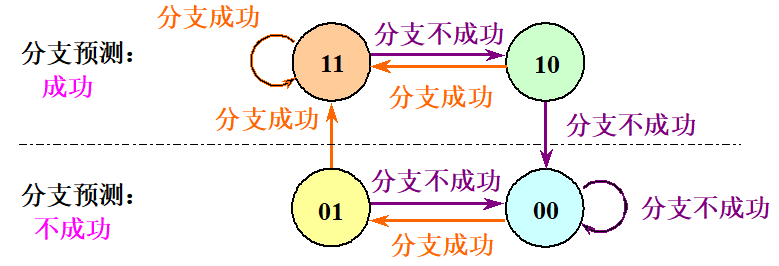
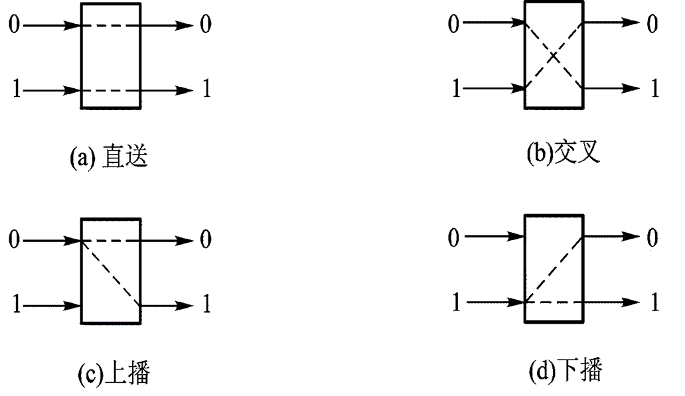

## 第1章 量化设计与分析基础

第一台通用电子计算机诞生于1946年
5个主流计算机类别：个人移动设备 桌面计算 服务器 集群/仓库级计算机 嵌入式计算机

### 可信任度

​    模块可靠性
​        ***平均无故障时间MTTF 失效率1/MTTF 服务中断平均修复时间MTTR$MTTF\times FIT=10^9$
​        *平均故障时间MTBF=MTTF+MTTR 
​        *如果系统中每个模块的生存期服从指数分布，则系统整体失效率是各个模块失效率之和
​    模块可用性
​        系统正常工作时间在连续两次正常服务间隔时间所占比率
​        *可用性=MTTF/(MTTF+MTTR)

### 性能

​    执行时间
​        计算机用户关心：缩短执行时间
​            执行时间多种定义
​            响应时间：完成某一任务花费全部时间，包括磁盘访问、存储器访问、输入/输出、操作系统开销
​            CPU时间：CPU执行给定程序花费的时间，不包含I/O等待时间以及运行其他程序时间
​        性能与执行时间成反比
​    吞吐率
​        数据处理中心操作人员关系：给定时间内完成任务数量
​    性能结果汇总 各测试程序执行时间的算术平均值

### Amdahl定律

​    加快某部件执行速度所能获得的系统性能加速比，受限于
​    该部件的执行时间占系统中总执行时间的百分比
​    *系统性能加速比=系统性能_改进后/系统性能_改进前
​                 =总执行时间_改进前/总执行时间_改进后
​    *可改进比例
​        在改进前的系统中，可改进部分的执行时间在总执行时间中所占的比例
​        总是<=1
​    *部件加速比
​        可改进部分改进以后性能提高的倍数
​        =改进前所需执行时间/改进后所需执行时间
​        一般>1（否则是失败的改进）
​    *改进后程序总执行时间
​        =不可改进部分执行时间+可改进部分改进后执行时间
​        =(1-可改进比例)*总执行时间_改进前
​            +(可改进比例*总执行时间_改进前)/部件加速比 
​    *系统加速比 
​        =总执行时间_改进前/总执行时间_改进后
​        =1/[(1-可改进比例)+可改进比例/部件加速比]
​    定律推论
​        如果只针对整个任务的一部分改进优化，所获得的加速比不超过1/(1-可改进比例)

### 处理器性能

​    *执行一个程序所需的CPU时间
​        =执行程序所需的时钟周期数*时钟周期时间，
​        时钟周期时间=1/系统时钟频率
​    *每条指令执行的平均时钟周期数CPI
​        =执行程序所需的时钟周期数/IC，
​        IC：所执行的指令条数
​    *程序执行CPU时间
​        =IC*CPI*时钟周期时间 
​    *CPU性能公式细化
​        计算机系统有n种指令 -> CPI_i IC_i
​        CPU时钟周期数=Σ(CPI_i * IC_i)
​    *CPU时间=执行程序所需的时钟周期数×时钟周期时间
​    *总CPI=执行程序所需的时钟周期数/IC=Σ[CPI_i * (IC_i/IC)]

## 第2章 指令集基本原理 附录A

### 通用寄存器型指令集

​    寄存器-寄存器型（RR型）
​        load-store结构
​        只有load、store指令能访问存储器
​    寄存器-存储器型（RM型）
​    存储器-存储器型（MM型）
堆栈 累加器 寄存器（RM型） 寄存器（RR型）
​    表达式C=A+B指令集结构的代码，假设A\B\C均保存在存储器单元

### 存储器寻址

​    <-赋值操作 Mem存储器 Regs寄存器组 方括号表示内容
​        Mem[Regs[R1]]：以寄存器R1中的内容作为地址的存储器单元中的内容
​    位移量寻址方式
​    立即数寻址方式
​        1/4的load指令和ALU指令采用立即数寻址    
​        指令集结构设计至少将立即数大小设置为8~16位

### 操作数类型与大小

​    操作数大小：字节（8位） 半字（16位） 字（32位） 双字（64位）
​    操作数类型：字符（ASCII码 1字节） 整数（二进制补码 字节、半字或单字） 浮点操作数（单精度1字 双精度双字） 十进制操作数类型（压缩BCD码 非压缩字符串直接表示）

### 指令集中的操作

​    操作类型：算术和逻辑运算 数据传输 控制 系统 浮点 十进制 字符串 图形
控制流指令
​    跳转：指令无条件改变控制流
​    分支：指令有条件改变控制流
​    能够改变控制流的指令：分支 跳转 过程调用 过程返回
​    改变控制流的大部分指令是分支指令（条件转移）
​    转移目标地址表示的常用方法
​        在指令中提供一个偏移量，由该偏移量和程序计数器（PC）的值相加而得出目标地址（PC相对寻址）
​        优点：有效减少表示目标地址所需位数，位置无关
​        关键：确定偏移量字段长度，4~8位可控制大多数
​    表示条件分支
​        条件码（CC）
​            可自由设置分支条件，但限制指令执行顺序
​        条件寄存器
​            简单，但占用寄存器
​        比较与分支
​            用一条指令就能实现分支，但流水方式时指令操作太多，一拍做不完
​    过程调用和返回
​        改变控制流 保存机器状态 保存返回地址
​        保存寄存器基本约定
​            保存在调用位置
​            保存在被调用过程内部

### 指令集编码

​    因素
​        允许尽可能多寄存器和寻址方式
​        指令平均字长和目标代码大小
​        便于硬件处理，指令字长是字节（8位）整数倍
​    格式
​        变长编码格式
​        定长编码格式
​        混合型编码格式

### MIPS体系结构

​    32个64位通用寄存器
​        R0，R1，...，R31
​        R0值永远是0
​    32个64位浮点数寄存器 可以存放32个单或双精度浮点数 寄存器存单精度时每个寄存器会有一半空着
​        F0，F1，...，F31 
​    特殊寄存器
​        浮点状态寄存器
​    数据寻址方式
​        立即数字段和偏移量字段都是16位
​        16位绝对寻址通过把R0作为基址寄存器完成
​        MIPS存储器按字节寻址，地址64位
​        存储器访问必须边界对齐
​    指令格式
​        寻址方式编译到操作码中
​        所有指令32位
​        操作码占6位
​        3类指令格式
​            I类
​                load指令、store指令、立即数指令、分支指令、寄存器跳转指令、寄存器链接跳转指令
​                OP(6) rs(5) rt(5) immediate(16)
​                PC相对寻址 PC+4(+)immediate -> MEMORY
​            R类
​                ALU指令、专用寄存器读/写指令、move指令
​                OP(6) rs(5 第一个源操作数) rt(5 第二个源操作数) rd(5 结果) shamt(5 移位指令的偏移量) func(6 OP字段是特定的"000000"，具体操作由func给定，如"100000"表示加法运算)
​            J类 
​                跳转指令、自陷指令、异常返回指令
​                OP(6) targerAddress(26)
​                指令字的低26位是偏移量，与PC相加形成跳转地址
​                具体操作：将PC高4位拼上26位直接地址，在最后添加2个"0"，形成32位目标地址（指令按字地址对齐，每条指令地址都是4的倍数）
​    操作
​        load和store
​            LD LW LB LBU LH L.S L.D
​            SD SW S.S SH
​        ALU 
​            DADDU DADDIU DSLL DSLT
​            DSLT R1,R2,R3: 若小于则置位 If(Regs[R2]< Regs[R3])Regs[R1]← 1 else Regs[R1]←0 
​        分支与跳转
​            J JAL JALR JR BEQZ BNE MOVZ
​        浮点操作
​            操作码指出操作数是单精度（SP）或双精度（DP）
​            加减乘除（分单双精度指令）
​            比较，根据结果设置浮点状态浮点状态寄存器某一位，
​            便于BC1T(若真则分支)或BC1F(若假则分支)测试该位

## 第3章 流水线

### 流水线基础知识

-   把一个重复过程分解为若干个子过程，每个子过程由专门功能部件实现，多个处理过程时间上错开，依次通过各功能段，每个子过程就可以与其他子过程并行

-   流水线每个子过程及其功能部件称为**流水线的段**，流水线的段数称为**流水线的深度**

-   指令流水线：取指令$\rightarrow$译码$\rightarrow$执行$\rightarrow$存结果

-   时空图：横坐标代表**时间**，纵坐标代表**流水线各个段**

-   流水线每一个功能部件后面都要有一个缓冲寄存器，称为**流水线寄存器**

-   流水线时间：

    通过时间：第一个任务从进入流水线到流出结果所需时间

    排空时间：最后一个任务从进入流水线到流出结果所需的时间

-   流水线分类：

    静态：同一时间内，多功能流水线中的各段只能按同一种功能的连接方式工作

    动态：同一时间内，多功能流水线中的各段可以按照不同的方式连接，同时执行多种功能

    比如说：静态一个时间段里在做浮加，那就必须等所有任务流出才能做别的，比如定乘，而动态则可以直接穿插

    线性：各段串行连接

    非线性：还会有反馈回路

    顺序：输出端任务流出顺序与输入端任务流入顺序完全相同

    乱序：可以不同，允许后进流水线任务先完成

-   流水线性能指标

    吞吐率：$TP=\frac{n}{T_K}$，单位时间内流水线完成的任务数量

    **1.**各段时间均相等流水线：流水线完成n个连续任务所需总时间

    （k段线性流水线）
    $$
    T_k=k\Delta t+(n-1)\Delta t=(k+n-1)\Delta t
    $$
    流水线实际吞吐率：$TP=\frac{n}{(k+n-1)\Delta t}$

    最大吞吐率：$TP_{max}=\lim_{n\rightarrow\infty}\frac{n}{(k+n-1)\Delta t}=\frac{1}{\Delta t}$

    **2.**各段时间不等流水线：

    流水线中时间最长的段称为**流水线的瓶颈段**

    实际吞吐率：$\Delta t_i是第i段的时间，共有k个段$
    $$
    TP=\frac{n}{\sum_{i=1}^{k}\Delta t_i+(n-1)max(\Delta t_1,\Delta t_2,\dots,\Delta t_k)}
    $$
    最大吞吐率：$TP_{max}=\frac{1}{max(\Delta t_1,\Delta t_2,\dots,\Delta t_k)}$

    解决：把瓶颈段细分（成串行的几段），提升最大吞吐率；重复设置瓶颈段（意思是多设这一段的功能部件，让它能同时流过好几个任务，例如：$3\Delta t则应该重复设置3个部件$）；

    加速比：不使用流水线（顺序执行）所用时间$T_s$，使用流水线后所用时间为$T_k$，则流水线加速比$S=\frac{T_s}{T_k}$

    **1.**流水线各段时间相等（$\Delta t$）

    $T_k=(k+n-1)\Delta t$

    $T_s=nk\Delta t$

    $S=\frac{nk}{k+n-1}$

    **2.**流水线各段时间不完全相等

    $S=\frac{n\sum_{i=1}^k\Delta t_i}{\sum_{i=1}^{k}\Delta t_i+(n-1)max(\Delta t_1,\Delta t_2,\dots,\Delta t_k)}$

    效率：流水线中的设备实际使用时间与整个运行时间的比值，即流水线设备的利用率

    从时空图上看，效率就是n个任务占用的时空面积和 k个段总的时空面积之比

    **1.**流水线各段时间相等（$\Delta t$）

    各段效率$e_i$相同：$e_1=e_2=\cdots =e_k=\frac{n\Delta t}{T_k}=\frac{n}{k+n-1}$

    整条流水线效率：$E=\frac{\sum_{i=1}^k e_i}{k}=\frac{ke_1}{k}=\frac{kn\Delta t}{kT_k}\Rightarrow E=\frac{n}{k+n-1}$

    最高效率：$E_{max}=\lim_{n\rightarrow\infty}\frac{n}{k+n-1}=1$

    **2.**各段时间不相等

    $E=\frac{n\sum_{i=1}^k\Delta t_i}{k[\sum_{i=1}^{k}\Delta t_i+(n-1)max(\Delta t_1,\Delta t_2,\dots,\Delta t_k)]}$
    
-   经典5段RISC流水线

    在这个实现方案中，分支指令需要2个时钟周期，store指令需要4个周期，其他指令需要5个周期完成

    **1.**取指令周期（IF）

    ​	$IR\leftarrow Mem[PC]$，$PC+4$（假设每条指令占4Byte）

    **2.**指令译码/读寄存器周期（ID）

    ​	译码；

    ​	用IR中寄存器编号访问通用寄存器组，**读出所需的操作数**

    ​	确定**是否为分支**，计算出分支目标地址

    **3.**执行/有效地址计算周期（EX）

    ​	存储器访问指令：ALU把所指定的**寄存器的内容与偏移量相加**，形成用于访	存的**有效地址**

    ​	寄存器-寄存器ALU指令：ALU按照操作码指定的操作对从**通用寄存器组**中读	取的**数据进行运算**

    ​	寄存器-立即数ALU指令：ALU按照操作码指定的操作对从**通用寄存器组**中读	取的**第一操作数**和**立即数**进行运算

    **4.**存储器访问/分支完成周期（MEM）

    ​	load指令：用上一个周期计算出的**有效地址**从**存储器**中**读出**相应的**数据**

    ​	store指令：把指定的数据**写入**这个**有效地址**所指出的**存储器单元**

    **5.**写回周期（WB）

    ​	ALU运算指令和load指令在这个周期把结果**数据写入**通用寄存器组

-   流水线实现的问题

    **1.**不会在同一时钟周期要求同一个功能段做两件不同的工作

    **2.**避免IF段的访存（取指令）与MEM段的访存（读/写数据）发生冲突

    **3.**ID段和WB段都要访问同一寄存器文件。ID段：读;WB段：写

    ​	解决：**写**操作安排在时钟周期**前半拍**，**读**操作安排在**后半拍**

    **4.**PC+4必须在IF段完成，为取下一条指令准备，设置专门加法器；分支指令也可能改变PC的值

### 流水线冒险

-   **$流水化加速比=\frac{非流水化指令平均执行时间}{流水化指令平均执行时间}=\frac{非流水化CPI}{流水化CPI}\times \frac{非流水化时钟周期}{流水化时钟周期}$**

    **$流水化CPI=理想CPI+每条指令的流水线停顿时钟周期 \newline =1+每条指令的流水线停顿时钟周期$**

-   结构冒险

    **如果某种指令组合因为资源冲突而不能正常执行**，则称该处理机有结构冒险

    **1.**插入暂停周期（气泡）

    时空图中写stall

    **2.**设置相互独立的指令存储器和数据存储器或者

    设置相互独立的指令**Cache**和数据**Cache**

-   数据冒险

    **当相关的指令靠得足够近时，它们在流水线中的重叠执行或者重新排序会改变指令读/写操作数的顺序，使之不同于它们非流水实现时的顺序**，则发生了数据冒险

    **1.转发**技术减少数据冒险引起的停顿（也称旁路和短路）

    ​	关键思想：在某条指令产生计算结果之前，其他指令并不真正立即需要该计	算结果，如果将计算结果从产生的地方直接送到其他指令需要它的地方，则	可以避免停顿

    **2.**不是所有数据冒险都可以由转发解决，需要增加流水线互锁硬件，**插入停顿**

-   控制冒险（分支冒险）

    分支成功：PC值改变为分支转移的目标地址

    MIPS流水线中，通常会在**ID末尾**，完成地址计算和条件判定后，才改变PC值

    不成功：PC的值保持正常递增，指向顺序的下一条指令

    **1.**降低分支代价，冻结流水线，保留或者删除分支之后的所有指令，直到知道分支目标地址

    **2.**预测分支失败

    允许分支指令后的指令继续在流水线流动，若确定失败，则流水线正常流动；若确定成功，把错误取出的指令转为空操作，按分支目标地址**重新取指令执行**

    **3.**预测分支成功

    起作用前提：先知道分支目标地址，后知道分支是否成功

    **4.**延迟分支

    把延迟分支看成是由原来的分支指令和若干个延迟槽构成（一般1个），不管分支是否成功，都要按顺序执行延迟槽中的指令

    调度：在延迟槽放入有用指令。由编译器完成：从前调度/从目标处调度/从失败处调度

    进一步改进，取消分支：当分支的实际执行方向和事先所预测的一样时，执行分支延迟槽中的指令，否则就将分支延迟槽中的指令转化成一个空操作

    分支机制性能：理想$CPI=1$

    $加速比=\frac{流水线深度}{1+分支导致的流水线停顿周期}=\frac{流水线深度}{1+分支频率\times 分支代价}$

    通过分支预测降低分支成本（分支预测缓冲区或分支历史表（BHT））

    BHT记录分支指令最近一次或几次的执行情况（成功或不成功），并据此进行预测

    两位分支预测性能与$n(\gt 2)$位分支预测性能差不多
    
    
    
    BHT适用情况：判定分支是否成功所需时间$\gt$确定分支目标地址所需时间
    
    前述5段经典流水线：由于判定分支是否成功和计算分支目标地址都是在ID段完成，所以BHT方法**不会**给该流水线带来好处

### 流水线的实现

-   MIPS基本流水线

    每一个时钟周期完成的工作看作是流水线的一段，每个时钟周期启动一条新的指令

-   流水寄存器

    作用：将各段工作隔开，保存相应段处理结果，向后传递将用到的数据或控制信息

    段与段之间设置流水寄存器：命名用其相邻的两个段的名称拼合而成，**例如ID段与EX段之间的流水寄存器用ID/EX表示**

    每个流水寄存器是由若干个寄存器构成的

    寄存器的命名形式为：$x.y$，所包含的字段的命名形式为：$x.y[s]$

    其中：x：流水寄存器名称， y：具体寄存器名称，s：字段名称

    **例如：$ID/EX.IR$：流水寄存器ID/EX中的子寄存器IR;**

    **$ID/EX.IR[op]$：该寄存器的op字段（即操作码字段）**

    增加了向后传递$IR$和从$MEM/WB.IR$回送到通用寄存器组的连接

    将对PC的修改移到了$IF$段，以便$PC$能及时地加4，为取下一条指令做好准备

-   流水线控制

    4个多路选择器$MUXi，i\in\{1,2,3,4\}$

    第5个多路器：从MEM/WB回传至通用寄存器组的写入地址应该是从$MEM/WB.IR[rd]$ 和$MEM/WB.IR[rt]$中选 一个

    寄存器－寄存器型ALU指令：选择$MEM/WB.IR[rd]$

    寄存器－立即数型ALU指令和load指令：选择$MEM/WB.IR[rt]$ 

-   数据冒险

    所有的数据冒险均可以在$ID$段检测到。如果存在数据冒险，就在相应的指令流出$ID$段之前将之暂停

    在$ID$段确定需要什么样的转发

    LOAD互锁：通过在$ID$段检测来消除因为load指令所导致的写后读（RAW）冒险互锁；检测冒险通过比较寄存器地址实现，此时load指令在$EX$段；若检测到RAW冲突，则**插入停顿**，使当前正处于$IF$段和$ID$段指令不再前进

    转发逻辑：通过比较流水寄存器中的**寄存器地址**来确定

-   分支

    分支指令的**条件测试和分支目标地址计算**在$EX$段完成，对**$PC$的修改**在$MEM$段完成。它所带来的分支延迟是3个时钟周期

    改进 ：提前到$ID$段，分支延迟1个时钟周期

    在$ID$段增设加法器，用于计算分支目标地址；

    把条件测试”$=0？$“的逻辑电路移到$ID$段

    结果直接回送到IF段的$MUX1$

## 第4章+层次结构存储系统-补充

### 直接映射Cache

-   假定数据在主存和Cache间的传送单位为512B

-   Cache大小：$2^{13}B=8KB=16行\times 512B/行$

-   主存大小：$2^{20}B=1024KB=2048块\times 512B/块$

-   $主存标记（7位）|Cache索引（4位）|块内地址（9位）$

    整个三块是主存地址，前两块是主存块号，后两块是Cache地址

    理解：三块区域从主存的层面来看是从大到小，主存标记TAG是由主存划分确定的

    例：$0220CH\rightarrow0000\space 0010\space 0010\space 0000\space 1100B$

    ​		$\rightarrow0000001\space 0001\space 000001100B$是第1块群中的0001块中的第12个单元

-   有效位

    $V|TAG|DATA$，V：1表示信息有效，0表示信息无效

    开机或复位时，使所有行的有效位V=0

    某行被替换后使其V=1

    某行装入新块时使其V=1

    通过使V=0来冲刷Cache（进程切换，DMA传送）

-   64KB直接映射Cache（块大小16B）

    Cache数据区容量64KB，主存地址为32位，按字节编址

    $数据区64KB\div 16B=4K行\Rightarrow 需要2^{2+10}=2^{12}范围的索引\newline\Rightarrow 需要12位索引$ 

    将主存（32位）地址分为$Tag（16位）|Index（12位）|Block\space offset（2位）|Byte\space offset（2位）$

    容量：$4K*(1+16+16*8)=580Kbits=72.5KB\Rightarrow 数据占\frac{64KB}{72.5KB}=88.3\%$

-   计算Cache容量

    例1：Cache64行，块大小16B，问地址1200映射到哪里

    $1200\div 16=75\space\space 75\space mod \space 64=11\Rightarrow映射到第11行Cache$

    例2：实现以下Cache需要多少位容量

    Cache：直接映射 、16K行数据、块大小为1个字(4B)、32位主存地址

    Cache存储布局如下：
    $$
    1|32-14-2|32\space\space \}2^{14}lines \\
    \Rightarrow Cache大小为2^{14}\times(32+(32-14-2)+1)=784Kbits
    $$
    理解：$32-14-2$，其中"-14"代表索引的14位，"-2"代表Block offset（1位）和Byte offset（1位），剩下的主存地址留给TAG

### 全相联映射Cache

-   假定数据在主存和Cache间的传送单位为512字

-   Cache大小：$2^{13}字=8K字=16行\times 512字/ 行$

-   主存大小：$2^{20}字=1024K字=2048块\times 512字/块$

-   $标记=主存块号（11位）|块内地址（9位）$

    整个两块组成主存地址

    例：对01E0CH单元访问$\rightarrow 0000\space0001\space1110\space0000\space1100B\rightarrow 00000001111\space 000001100B$是第15块中的第12个单元

-   理解：主存可以映射到任意一个cache行

### 组相联映射Cache

-   将Cache所有行分组，把主存块映射到Cache固定组的任意行中

-   Cache组号=主存块号 mod Cache组数

-   例：假定Cache划分为：$8K字=8组\times 2行/组\times 512字/行$

    $4=100\space mod\space 8\Rightarrow$主存第100块映射到Cache的第4组任意行

-   当Cache组数为1时，变为全相联映射；当每组只有一个槽时，变为直接映射

-   理解：在同一组代表这些数有同一特征，并且这个组的槽提供了对它们的容纳量；

-   假定数据在主存和Cache间的传送单位为512字

-   Cache大小：$2^{13}字=8K字=16行\times 512字/行$

-   主存大小：$2^{20}字=1024K字=2048块\times 512字/块$

-   $标记（8位）|Cache索引（3位）|块内地址（9位）$

    标记和对应Cache组中每个Cache标记进行比较

-   例：对0120CH单元访问$\rightarrow 0000\space0001\space0010\space0000\space1100B\rightarrow00000001\space001\space000001100B$

    第1组群中001块（即第9块）中第12个单元，所以映射到第1组

## 第4章+存储器层次结构

-   写策略与调块$\rightarrow$命中数

    写回法：执行“写”操作时，只写入Cache。仅当Cache中相应的块被替换时，才写回主存。 (设置“修改位”) ── 按写分配：写不命中时，先把所写单元所在的块调入Cache，再行写入
    写直达法：执行“写”操作时，不仅写入Cache，而且也写入下一级存储器 ── 不按写分配：写不命中时，直接写入下一级存储器而不调块

-   缓存性能

    命中率

    平均访问时间 访问块时间 不命中代价 传送信息块时间

-   CPU执行时间＝（CPU执行周期数+存储器停顿周期数）× 时钟周期时间

    存储器停顿时钟周期数＝“读”的次数×读缺失率×读缺失代价＋“写”的次数×写缺失率×写缺失代价

-   $缺失率=\frac{每条指令缺失数}{每条指令的访存数}$

-   局部缺失率 全局缺失率

-   平均访问时间＝命中时间L1＋缺失率L1 × 缺失代价L1
                          ＝命中时间L1 ＋缺失率L1 × (命中时间L2＋缺失率L2×缺失代价L2)

-   每条指令的平均存储器停顿时间 = 每条指令的缺失数L1 ×命中时间L2+每条指令的缺失数L2 ×缺失代价L2

-   $两个N*N数组相乘，最坏情况Cache失效次数2N^3+N^2，修改后按块相乘，失效次数\frac{2N^3}{B}+N^2$

## 第5章+指令级并行

-   Tomasulo算法
-   以多发射和静态调度来开发ILP
-   以动态调度、多发射和推测来开发ILP

## 第6章+向量体系结构

-   链接

-   循环间相关

    同一数组中，索引值$a\times i+b和c\times i+d$载入，i是for循环变量

    如果存在循环间相关，那么$GCD(c,a)|(d-b)$

## 第7章+互连网络

-   互连函数

    1.交换函数（位反）

    $E_k(x_{n-1}x_{n-2}\cdots x_{k+1}x_kx_{k-1}\cdots x_1x_0)=x_{n-1}x_{n-2}\cdots x_{k+1}\overline{x_k}x_{k-1}\cdots x_1x_0$

    2.均匀洗牌函数（左移）

    $S(x_{n-1}x_{n-2}\cdots x_1x_0)=x_{n-2}x_{n-3}\cdots x_1x_0x_{n-1}$

    同样有逆均匀洗牌函数（右移）

    $S^{-1}(x_{n-1}x_{n-2}\cdots x_1x_0)=x_{0}x_{n-1}x_{n-2}\cdots x_1$

    3.碟式函数（最高最低位互换）

    $B(x_{n-1}x_{n-2}\cdots x_1x_0)=x_{0}x_{n-2}\cdots x_1x_{n-1}$

    4.反位序函数（整个倒过来）

    $R(x_{n-1}x_{n-2}\cdots x_1x_0)=x_{0}x_{1}\cdots x_{n-2}x_{n-1}$

    4.PM2I函数

    $PM2_{+i}=x+2^i\space mod\space N$

    $PM2_{-i}=x-2^i\space mod\space N$

    N是结点数

-   静态互连网络 度 直径

-   动态互连网络

    $2\times  2开关$ 直送 交叉 上播 下播

## 第8章+线程级并行

-   对称共享存储器多处理器的性能

    真假共享缺失 理解：该缺失是否的确是，由于**自身**相关信息修改或缺失，导致的有效位变化

-   目录式缓存一致性协议

-   基本硬件原语

    LL/SC

    自旋锁 原子交换操作（EXCH）

    LL替代LD，SC替代EXCH